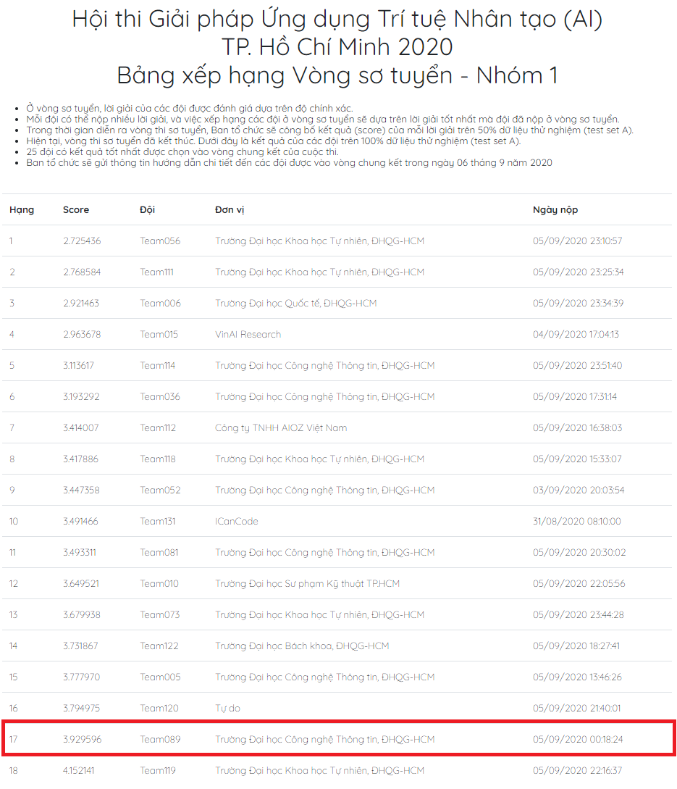

# Hội thi Giải pháp Ứng dụng Trí tuệ Nhân tạo (AI) TP. Hồ Chí Minh 2020 - Chủ đề: “Trí tuệ nhân tạo với giao thông thông minh”
## Thông tin chi tiết hội thi:
http://aichallenge.hochiminhcity.gov.vn/huong-dan-nhom-1
## Thông tin đội:
* Trường Đại học Công nghệ Thông tin - ĐHQG TP.HCM
* **Team 089:**
1. Tô Viết Anh - 18520471
2. Nguyễn Huỳnh Anh - 18520456
3. Nguyễn Minh Châu - 18520519
4. Nguyễn Hữu Doanh - 18520606
## Kết quả vòng sơ tuyển:
Team đạt được vị trí 17/53 đội đã submit kết quả với score là 3.929596

